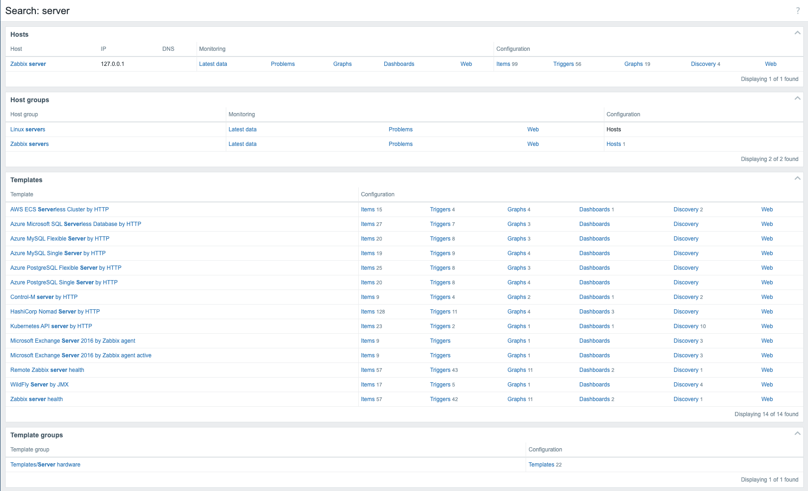
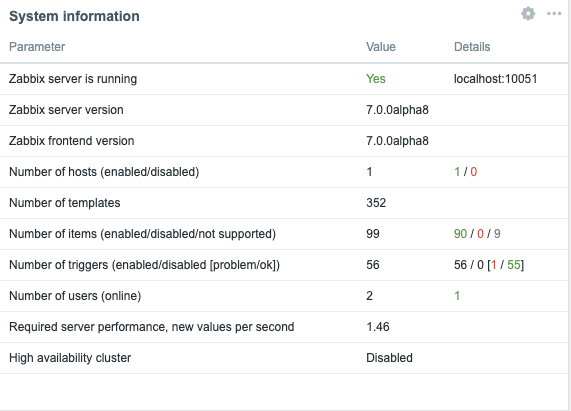
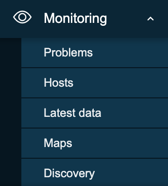
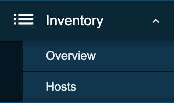
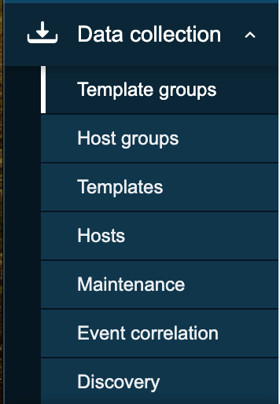
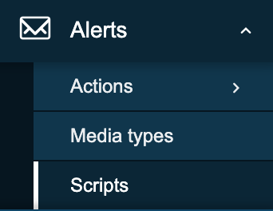
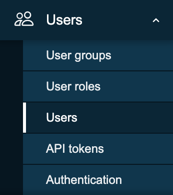

# Zabbix Interface

This chapter is going to cover the basics we need to know when it comes to the Zabbix userinterface and the thing we need to know before we can start to fully dive into our monitoring tool. We will see how the userinteface works how to add a host, groups users, items ... so that we have a good understanding of the basics. This is something that is sometimes missed and can lead to frustrations not knowing why things don't work like we had expected them to work. So even if you are an advanced user it may be usefull to have a look into this chapter.


### Overview of the interface

With Zabbix 7 the user interface after logging in is a bit changed. Our menu on the left side of the screen has has a small overhaul. Let's dive into it.
When we login into our Zabbix setup the first time with our Admin user we see a page like this where we have our ```main window``` in <font color='green'>green</font>  our ```main menu``` marked in <font color='red'>red</font> and our ```links``` marked in <font color='gold'>yellow</font>.


The main menu can be hidden by collapsing it completely or to reduce it to a set of small icons. 


When we click on the button with the 2 arrows to the left:

{ width="200" } 

You will see that the menu collapses to a set of small icons. Pressing ">>" will bring the ```main menu``` back to it's original state. Pressing the box with the arrow sticking out next to the "<<" button will hide the ```main menu``` completely.

{ width="200" }

 To get the main menu back it's not too difficult we just look for the button on the left with three horizontal lines and click it. This will bring the menu back and clicking on the box with the arrow agian will bring the ```main menu``` back.

Yet another way to make the screen bigger that is quit useful for monitors in NOK teams for example is the kiosk mode button. This one is however located on the left side of your screen and looks like 4 arrows pointing to every corner of the screen. Pressing this button will remove all the menus and leave only main window to focus on.

{ width="70" } { width="70" }

When wanting to leave the kios mode the button will be changed to 2 arrows poiting to the inside of the screen. Pressing this button will revert us back to the original state.

???+ tip
    We can also enter and exit kiosk mode by making use of parameters in our Zabbix url: 
    ```/zabbix.php?action=dashboard.view&kiosk=1``` - activate kiosk mode
    or ```/zabbix.php?action=dashboard.view&kiosk=0``` - activate normal mode

???+ note
    There are many other page parameters we can use. A full list can be found [here](https://www.zabbix.com/documentation/7.0/en/manual/web_interface/page_parameters)
Zabbix also has a global search menu that we can use to find hosts, host groups and templates.

{ width="200" }

If we look in the search box for ```server``` you will see that we get an overview of all templates, host groups and hosts with the name ```server``` in it.



## Main menu

Our main menu on the left consists of a few sections, 9 to be exact:

| Menu Name | Details |
| ---- | ---- |
| Dashboards | Contains an overview of all the dashboards we have access to. |
| Monitoring | Shows us the hosts, problems, latest data, maps, ... |
| Services |  An overview of all the Services and SLA settings. |
| Inventory | An overview of our collected inventory data. |
| Reports | Shows us the system information, scheduled reports, audit logs, action logs, etc .|
| Data collection | Contains all things related to collecting data like hosts, templates, maintenance, discovery, ... |
| Alert | The configuration of our media types, scripts and actions |
| Users	|  User configuration like user roles, user groups, authentication, API tokes, ... |
| Administration | The administration part containing all global settings, housekeeper, proxies, queue, ... |

## Links menu

Our last part the ```links``` part  contain a set of useful links that we can use:

| Menu name | Details |
| ---- | ---- |
| Support |  This brings us to the technical support page that you can buy from Zabbix. Remember that your local partner is also able to sell these contracts and can help you in your own language. [Your local distributors](https://www.zabbix.com/distributors) |
| Integrations | The official zabbix [integeration page](https://www.zabbix.com/integrations) |
| Help | The link to the documentation of your [Zabbix version](https://www.zabbix.com/documentation/7.0/) |
| User settings	| The user profile settings. |
| Sign out | Log out of the current session. |


There are still a few buttons that we need to cover on the right side of our screen


The edit button allows us to change our dashboard. This is something we will cover later.
On the far left side there is a  "?" this will bring you to the Zabbix documentation page that explains everything about the dashboard.
The button on the right side with the 3 horizontal lines is the one to share, rename, delete, ... our dashboards.



## System Information

There is also a box on the dashboard called ```System Information```. This widget will show you the current System status of your Zabbix setup. Let's go over the different lines of information as they are important to understand.

|Parameter|Value|Details|
|----|----|----|
|Zabbix server is running | This gives us the status of our zabbix server if it is running yes or no and if it is running on our localhost or another IP and on what port the zabbix server is listening. If no trapper is listening the rest of the information can not be displayed|IP and port of the Zabbix server|
|Zabbix server version | This shows us the version of the ```Zabbix server``` so the version you see at the bottom of your screen is the one from the Zabbix frontend and can be different but should be in the same major version.| Version Number |
|Zabbix frontend version | This is the version of the frontend and should match with what you see at the bottom of your screen.| Version Number | 
|Number of hosts (enabled/disabled) | The total number of hosts configured on our system | How many of those are enabled and disabled |
|Number of templates | The number of templates installed on our Zabbix server. | |
|Number of items (enabled/disabled/not supported) | This line shows us the number of items we have configured in total in this case 99 | 90 are enabled and 0 are disabled but 9 of them are unsupported. This last number is important as those are items not working. We will look into this later why it happens and how to fix it. For now remember that a high number of unsupported items is not a good idea.|
|Number of triggers (Enabled/disabled[problem/ok]) | The number of triggers configured | Number of enabled and disabled triggers. Just as with items we also see if there are triggers that are in a problem state or ok state. A trigger in a problem state is a non working trigger something we need to monitor and fix. We will cover this also later.|
|Number of users (online) | Here we see the number of users that are configured on our system | The nunber of users currently online. |
|Required server performance, nvps | The number of new values per second that Zabbix will process per second. | This is just an estimated number as some values we get are unknown so the real value is probably higher. So we can have some indication about how many IOPS we need and how busy our database is. A better indication is probably the internal item ```zabbix[wcache,values,all]``` |
|High availability cluser |  It will show us if we are running on a Zabbix HA cluster or not | Failover delay once HA is activated |

???+ Tip
    System information may display some additonal warnings like when your database doesnt have the correct character set or collation UTF-8. Also when the database you used is lower or higher then the recommended version or when there are misconfigurations on housekeeper or TimescaleDB. Another warning you can see is about database history tables that aren't upgraded or primary keys that have not been set. This is possible if you are coming from an older version before Zabbix 6 and never did the upgrade.


## The main menu explained

It's important to know that we have so far seen our dashboard with the Admin user and that this user is a ```Zabbix Super Admin``` user. This means that the user has no restrictions. Zabbix works with 3 different levels of users we have the regular users, Zabbix Admin and Zabbix Super Admin users. Let's have a look

</br>

{ align=left }

* A ```Zabbix User``` will only see the <font color='red'>red</font> part of our ```main menu``` and will only be able to see our collected data.
</br>
</br>
</br>
</br>
</br>
</br>
* A ```Zabbix Admin``` will see the red part and the <font color='gold'>yellow</font>  part of the ```main menu``` and is able to change our configuration.
</br>
</br>
* A ```Zabbix Super Admin``` will see the complete ```main menu``` and so is able to change the configuration and all the global settings.
</br>
</br>
</br>

{ align=right width="180" }

* Problems: This page will give us an overview of all the problems. With filter we can look at recent problems past problems and problems that are active now. There are many more filters tor drill down more.
* Hosts: This will give us a quick overview page with whats happening on our hosts and allows us to quickly go to the latest data, graphs and dashboards.
* Latest data: This page I probably use the most, it shows us all the information collected from all our hosts.
* Maps: The location where we can create map that are an oveview of our IT infrastructure very useful to get a high level overview of the network.
* Discovery: When we run a network discovery this is the place where we can find the results.
</br>
</br>
---

{ align=left width="180" }

* Services: This page will give us a high level overview of all services configured in Zabbix.
* SLA: An overview of all the SLAs configured in Zabbix.
* SLA Report: Here we can watch all SLA reports based on our filters.
</br>
</br>
---

{ align=right width="180" }

* Overview: A place where we can watch all our iventory data that we have retrieved from our hosts.
* Hosts: Here we can filter by host and watch all inventory data for the hosts we have selected.

---

{ align=left width="180" }

* System information: System information is a summary of key Zabbix server and system data.
* Scheduled reports: The place where we can schedule our reports, a pdf of the dashboard that will be sent at a specified time and date.
* Availability report: A nice overview where we can see what trigger has been in ok/nok state for how much % of the time 
* Top 100 triggers: Another page I visit a lot here we have our top list with triggers that have been in a nok state.
* Audit log: An overview of the user activity that happend on our system. Useful if we want to know who did what and when.
* Action log: A detailed overview of our actions can be found here. What mail was sent to who and when ...?
* Notifications: A quick overview of the number of notifications sent to each user.

---

{ align=right width="180" }

* Template groups:
* Host groups: 
* Templates:
* Hosts:
* Maintenance:
* Event correlation:
* Discovery:

---

{ align=left width="180" }

* Actions:
* Media types:
* Scripts:
</br>
</br>

---

{ align=right width="180" }

* User groups:
* User roles:
* Users:
* API tokens:
* Authentication: 
</br>
</br>

---

{ align=left width="180" }

* General: 
* Audit log:
* Housekeeping:
* Proxies:
* Macros:
* Queue:

---

???+ info
    More information can be found in the online Zabbix documentation [here](https://www.zabbix.com/documentation/7.0/en/manual/web_interface/frontend_sections)

??? +info
    You will see that Zabbix is using the modal forms in the frontend on many places. The problem is that they are not movable. [This](https://github.com/gr8b/zabbix-module-uitwix/) module created by one of the Zabbix devs ```UI Twix``` will solve this problem for you.
