# Zabbix Users & User groups

Now that we know how the Zabbix dashboard is build up our first task will be to create a user. In case you missed it the standard Zabbix (yes the capital Z here is eeded to login.) user is Admin and has the password zabbix so we need to change this ASAP. 
The most confusing part is probably that the user Admin in zabbix is actually a ```super admin``` but more about that later.

## Changing the Zabbix super admin password

In our menu on the right side of the screen, click the ```Users``` section, and then choose ```users```. As you can see here in the screenshot.


You will now see a list of all the users that are created on the system when installing a new Zabbix instance. Here you will always see a list of all users that are configured on the system.

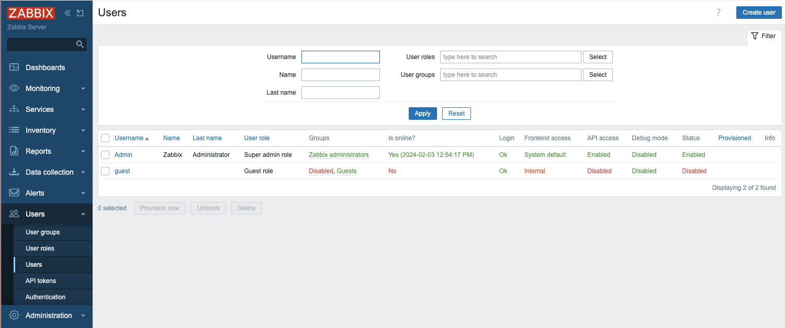

To change the password, do the following steps:
- Click user ```Admin```
- Click on the button ```Change password```.
- Fill in the current password, ```zabbix```
- Fill in the new password twice and press ```Update``` at the bottom of the page.

## Zabbix User types

Before we create new users, it's important to know that Zabbix has three user types that are built-in.

<html>
  <head>
    <style>
      thead th { text-align:left; background:grey; color:white}
      tbody th { text-align:right; background: lightgrey; color:whitwhitee}
    </style>
  </head>
<body>
  <table>
    <thead>
      <tr>
        <th>User type</th><th>Description</th>
      </tr>
    </thead>
  <tbody>
    <tr>
      <th>Zabbix User</th><td>This is a normal user that only has read-only permissions if given. So there are no permissions assigned by default.</td>
    </tr>
    <tr>
      <th>Zabbix Admin</th><td>A user with read/write permissions. Just like the Zabbix user, there are no permissions by default. However access can be denied to some groups.</td>
    </tr>
    <tr>
      <th>Zabbix Super Admin</th><td>A user with group read/write permissions. The user will have read/write access to all host and template groups. Access can't be revoked by denying access to groups, like with a normal admin.</td>
    </tr>
      </tbody>
    </table>
  </body>
</html>


Besides these differences, these users also have different access rights to our menu. Let's have a closer look.

- A normal user will only see a part of our menu on the left. Also, some sub-sections of the menu will not be visible. An ```Admin``` user will have more rights than a regular user and will be able to make some configuration changes in Zabbix. A ```Super Admin``` user will have unlimted right and see every part of the menu. The only way to limit a ```Super Admin``` will be by making use of roles. Something we cover later.
- An ```Admin``` user will have more rights than a regular user and will be able to make some configuration changes in Zabbix.
- A ```Super Admin``` can access all parts of the menu. 

This table gives an overview of all the permissions a Zabbix user, admin, and super admin have in the Zabbix menu:

<html>
<head>
<style>
thead th { text-align:left; background:grey; color:white; height: 20px }
tbody th { text-align:center; background: lightgrey; color:whitwhitee }
</style>
</head>
<body>
<table>
  <thead>
    <tr>
      <th> </th><th>Zabbix User</th><th>Zabbix Admin</th><th>Zabbix Super Admin</th>
    </tr>
  </thead>
<tbody>
  <thead>
    <tr>
      <th >Dashboards</th><td><center>&#9989;</center></td><td><center>&#9989;</center></td><td><center>&#9989;</center></td>
    <tr>
  </thead>
  <thead>
    <tr>
      <th>Monitoring</th><td><center>&#9989;</center></td><td><center>&#9989;</center></td><td><center>&#9989;</center></td>
    </tr>
  </thead>
    <tr>
      <th>- Problems</th><td><center>&#9989;</center></td><td><center>&#9989;</center></td><td><center>&#9989;</center></td>
    </tr>
    <tr>
      <th>- Hosts</th><td><center>&#9989;</center></td><td><center>&#9989;</center></td><td><center>&#9989;</center></td>
    </tr>
    <tr>
      <th>- Latest data</th><td><center>&#9989;</center></td><td><center>&#9989;</center></td><td><center>&#9989;</center></td>
    </tr>
    <tr>
      <th>- Maps</th><td><center>&#9989;</center></td><td><center>&#9989;</center></td><td><center>&#9989;</center></td>
    </tr>
    <tr>
      <th>- Discovery</th><td><center>&#10060;</center></td><td><center>&#9989;</center></td><td><center>&#9989;</center></td>
    </tr>
  <thead>
    <tr>
      <th>Services</th><th><center>&#9989;</center></th><th><center>&#9989;</center></th><th><center>&#9989;</center></th>
    </tr>
  </thead>
    <tr>
      <th>- Services</th><td><center>&#9989;</center></td><td><center>&#9989;</center></td><td><center>&#9989;</center></td>
    </tr>
    <tr>
      <th>- SLA</th><td><center>&#10060;</center></td><td><center>&#9989;</center></td><td><center>&#9989;</center></td>
    </tr>
    <tr>
      <th>- SLA Report</th><td><center>&#9989;;</center></td><td><center>&#9989;</center></td><td><center>&#9989;</center></td>
    </tr>
  <thead>
    <tr>
      <th>Inventory</th><th><center>&#9989;</center></th><th><center>&#9989;</center></th><th><center>&#9989;</center></th>
    </tr>
  </thead>
    <tr>
      <th>- Overview</th><td><center>&#9989;</center></td><td><center>&#9989;</center></td><td><center>&#9989;</center></td>
    </tr>
    <tr>
      <th>- Hosts</th><td><center>&#9989;</center></td><td><center>&#9989;</center></td><td><center>&#9989;</center></td>
    </tr>
  <thead>
    <tr>
      <th>Reports</th><th><center>&#9989;</center></th><th><center>&#9989;</center></th><th><center>&#9989;</center></th>
    </tr>
  </thead>
    <tr>
      <th>- System information</th><td><center>&#10060;</center></td><td><center>&#10060;</center></td><td><center>&#9989;</center></td>
    </tr>
    <tr>
      <th>- Scheduled reports</th><td><center>&#10060;</center></td><td><center>&#9989;</center></td><td><center>&#9989;</center></td>
    </tr>
    <tr>
      <th>- Availability report</th><td><center>&#9989;</center></td><td><center>&#9989;</center></td><td><center>&#9989;</center></td>
    </tr>
    <tr>
      <th>- Triggers top 100</th><td><center>&#9989;</center></td><td><center>&#9989;</center></td><td><center>&#9989;</center></td>
    </tr>
    <tr>
      <th>- Audit log</th><td><center>&#10060;</center></td><td><center>&#10060;</center></td><td><center>&#9989;</center></td>
    </tr>
    <tr>
      <th>- Action log</th><td><center>&#10060;</center></td><td><center>&#10060;</center></td><td><center>&#9989;</center></td>
    </tr>
    <tr>
      <th>- Notifications</th><td><center>&#10060;</center></td><td><center>&#9989;</center></td><td><center>&#9989;</center></td>
    </tr>
  <thead>
    <tr>
      <th>Data Collection</th><th><center>&#10060;</center></th><th><center>&#9989;</center></th><th><center>&#9989;</center></th>
    </tr>
  </thead>
    <tr>
      <th>- Template groups</th><td><center>&#10060;</center></td><td><center>&#9989;</center></td><td><center>&#9989;</center></td>
    </tr>
    <tr>
      <th>- Host groups</th><td><center>&#10060;</center></td><td><center>&#9989;</center></td><td><center>&#9989;</center></td>
    </tr>
    <tr>
      <th>- Templates</th><td><center>&#10060;</center></td><td><center>&#9989;</center></td><td><center>&#9989;</center></td>
    </tr>
    <tr>
      <th>- Hosts</th><td><center>&#10060;</center></td><td><center>&#9989;</center></td><td><center>&#9989;</center></td>
    </tr>
    <tr>
      <th>- Maintenance</th><td><center>&#10060;</center></td><td><center>&#9989;</center></td><td><center>&#9989;</center></td>
    </tr>
    <tr>
      <th>- Event correlation</th><td><center>&#10060;</center></td><td><center>&#10060;</center></td><td><center>&#9989;</center></td>
    </tr>
    <tr>
      <th>- Discovery</th><td><center>&#10060;</center></td><td><center>&#9989;</center></td><td><center>&#9989;</center></td>
    </tr>
  <thead>
    <tr>
      <th>Alerts</th><th><center>&#10060;</center></th><th><center>&#9989;</center></th><th><center>&#9989;</center></th>
    </tr>
  </thead>
    <tr>
      <th>- Trigger actions</th><td><center>&#10060;</center></td><td><center>&#9989;</center></td><td><center>&#9989;</center></td>
    </tr>
    <tr>
      <th>- Service actions</th><td><center>&#10060;</center></td><td><center>&#9989;</center></td><td><center>&#9989;</center></td>
    </tr>
    <tr>
      <th>- Autoregistration actions</th><td><center>&#10060;</center></td><td><center>&#9989;</center></td><td><center>&#9989;</center></td>
    </tr>
    <tr>
      <th>- Internal actions</th><td><center>&#10060;</center></td><td><center>&#9989;</center></td><td><center>&#9989;</center></td>
    </tr>
    <tr>
      <th>- Media types</th><td><center>&#10060;</center></td><td><center>&#10060;</center></td><td><center>&#9989;</center></td>
    </tr>
    <tr>
      <th>- Scripts</th><td><center>&#10060;</center></td><td><center>&#10060;</center></td><td><center>&#9989;</center></td>
    </tr>
  <thead>
    <tr>
      <th>Users</th><th><center>&#10060;</center></th><th><center>&#10060;</center></th><th><center>&#9989;</center></th>
    </tr>
  </thead>
    <tr>
      <th>- User groups</th><td><center>&#10060;</center></td><td><center>&#10060;</center></td><td><center>&#9989;</center></td>
    </tr>
    <tr>
      <th>- User roles</th><td><center>&#10060;</center></td><td><center>&#10060;</center></td><td><center>&#9989;</center></td>
    </tr>
    <tr>
      <th>- Users</th><td><center>&#10060;</center></td><td><center>&#10060;</center></td><td><center>&#9989;</center></td>
    </tr>
    <tr>
      <th>- Api tokens</th><td><center>&#10060;</center></td><td><center>&#10060;</center></td><td><center>&#9989;</center></td>
    </tr>
    <tr>
      <th>- Authentication</th><td><center>&#10060;</center></td><td><center>&#10060;</center></td><td><center>&#9989;</center></td>
    </tr>
  <thead>
    <tr>
      <th>Administration</th><th><center>&#10060;</center></th><th><center>&#10060;</center></th><th><center>&#9989;</center></th>
    </tr>
  </thead>
    <tr>
      <th>- General</th><td><center>&#10060;</center></td><td><center>&#10060;</center></td><td><center>&#9989;</center></td>
    </tr>
    <tr>
      <th>- Audit log</th><td><center>&#10060;</center></td><td><center>&#10060;</center></td><td><center>&#9989;</center></td>
    </tr>
    <tr>
      <th>- Housekeeping</th><td><center>&#10060;</center></td><td><center>&#10060;</center></td><td><center>&#9989;</center></td>
    </tr>
    <tr>
      <th>- Proxies</th><td><center>&#10060;</center></td><td><center>&#10060;</center></td><td><center>&#9989;</center></td>
    </tr>
    <tr>
      <th>- Macros</th><td><center>&#10060;</center></td><td><center>&#10060;</center></td><td><center>&#9989;</center></td>
    </tr>
    <tr>
      <th>- Queue</th><td><center>&#10060;</center></td><td><center>&#10060;</center></td><td><center>&#9989;</center></td>
    </tr>
  </tbody>
</table>
</body>
</html>

- An ```Admin``` user will have more rights than a regular user and will be able to make some configuration changes in Zabbix.
- A ```Super Admin``` can access all parts of the menu. 

## Creating a new User in Zabbix

So now that we are in the users section of Zabbix, it's probably a good time to create a new user for our system. If you skipped the previous step, go to the menu ```Users``` -> ```Users```.

Click on the top right on ```Create user``` and fill in the details of your new users. You will see that some fields have red asterisks in front of them, like Username and Password, ... this means that those fields are mandatory to fill in.


#### Strengthen the Zabbix password policy.

Zabbix passwords rely on a minimum length of 8 characters and also block a list of easy-to-guess passwords. We can make our passwords more secure by telling Zabbix that our passwords must contain uppercase and lowercase characters, a digit, and a special character. This policy is a global policy that will be enforced, and we have to set this policy as Super Admin. Go to the menu Users -> Authentication. In older versions, you can find it under Administration Authentication.


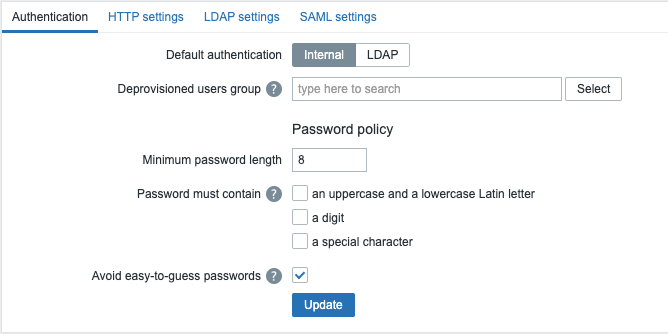


<html>
  <head>
    <style>
      thead th { text-align:left; background:grey; color:white}
      tbody th { text-align:right; background: lightgrey; color:whitwhitee}
    </style>
  </head>
<body>
<table>
  <thead>
    <tr>
      <th>Parameter</th><th>Description</th>
      </tr>
  </thead>
<tbody>
  <tr>
    <th>Username</th><td>A unique name that will be used as username when we login.</td>
  </tr>
  <tr>
    <th>Name</th><td>The users firstname this field is optional visible in acknowledgment information and notification recipient information if set.</td>
  </tr>
  <tr>
    <th>Last Name</th><td>Users last name. Optional, this field is optional visible in acknowledgment information and notification recipient information if set.</td>
  </tr>
  <tr>
    <th>Groups</th><td>Select what group the user will belong to. Atleast 1 group needs to be selected. This feeld will auto complete or you can press the '''Select''' button at the end of the field.</td>
  </tr>
  <tr>
    <th>Password</th><td>There are 2 password fields they can only be used for internal authentication but more about this later. If the user has the Super admin role then clicking on the Change password button opens an additional field to entering the current (old) password. On a successful password change, the user for which the password was changed will be logged out of all active sessions.</td>
  </tr>
  <tr>
    <th>Language</th><td>Language of the frontend. The php gettext extension is required for the translations to work. And the language needs to be configured on the system. See the chapter "Installing Zabbix" in case you forgot.</td>
  </tr>
  <tr>
    <th>Timezone</th><td>Select the time zone per user or use the default timezone that is configured on the Zabbix server.</td>
  </tr>
  <tr>
    <th>Theme</th><td>Here users can select their own look and feel by choosing one of the 4 themes provided by Zabbix or another custom made theme. Default will switch to the default theme chosen by the admin.</td>
  </tr>
  <tr>
    <th>Auto-Login</th><td>Check this box so that the user will be remembered for 30 days. The browser must accept cookies for this to work.</td>
  </tr>
  <tr>
    <th>Auto-Logout</th><td>Checking this box makes sure the user gets logged out automatically, after the set amount of seconds (minimum 90 seconds, maximum 1 day). Time suffixes are supported, e.g. 90s, 5m, 2h, 1d. Note that this option will not work if : <li>If the "Show warning if Zabbix server is down" global configuration option is enabled and Zabbix frontend is kept open.</li><li>When Monitoring menu pages perform background information refreshes.</li><li>If logging in with the Remember me for 30 days option checked.</li></td>
  </tr>
  <tr>
    <th>Refresh</th><td>Set the refresh rate used for graphs, plain text data, etc. Can be set to 0 to disable. Time suffixes are supported. Ex: 90s, 5m, 1h.</td>
  </tr>
  <tr>
    <th>Rows per page</th><td>Define how many rows per page will be displayed in lists.</td>
  </tr>
  <tr>
    <th>URL(after login)</th><td>You can make Zabbix transfer the user to a specific URL after successful login. This can be useful for monitors in NOC team for example so you arrive on a specific dashboard that is maximised. You can make Zabbix transfer the user to a specific URL after successful login. This can be useful for monitors in NOC team for example so you arrive on a specific dashboard that is maximised.</td>
  </tr>
</tbody>
</table>
</body>
</html>


### User Media

The tab ''' Media ''' contains a list of all media that are defined for our user. Media is used for sending notifications to the user. We can click the ```Add``` button.


Adding the media here is not enough to receive notification; we also need to configure our media properly, and we still need to configure actions as well.
When pressing the ''' Add ''' button, we get a popup where we can select some information.

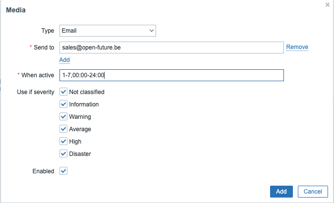

<html>
<head>
<style>
thead th { text-align:left; background:grey; color:white}
tbody th { text-align:right; background: lightgrey; color:whitwhitee}
</style>
</head>
<body>
<table>
<thead>
<tr>
<th>Parameter</th><th>Description</th>
</tr>
</thead>
<tbody>
<tr>
<th>Type</th><td>A drop down list with the names of all media types. When a media type is disabled it will be in red.</td>
</tr>
<tr>
<th>Send to</th><td>Here we can provide contact information. For an email media type it is possible to add several addresses by clicking on '''Add'''  below the address field. In this case, the notification will be sent to all email addresses provided. It's also possible to specify recipient name in the Send to field of the email recipient in a format 'Recipient name &lt;address1@company.com>'. Note that if a recipient name is provided, an email address should be wrapped in angle brackets (<>). UTF-8 characters in the name are supported, quoted pairs and comments are not. For example: John Doe &lt;manager@open-future.com> and manager@nycdatacenter.com are both valid formats. Incorrect examples: John Doe manager@open-future.com, %%"Zabbix\@\&lt;H(comment)Q\>" zabbix@company.com %%.<td>
</tr>
<tr>
<th>when active</th><td>The time when media will be active from monday till sundat, 1-7 and the time from 00:00 till 24:00 for example only in weekends from 6 in the morning till 5 in the evening: 6-7,06-17:00i. This is based on the user his timezone</td>
</tr>
<tr>
<th>Use if severity</th><td>A list of checkboxes from the severities you would like to recieve notifications from. Selected severities will be displayed in color. !! Read the warning below!!</td>
</tr>
<tr>
<th>Status</th><td>Status of the media we have selected either enabled or disabled ( in use or not )</td>
</tr>
</tbody>
</table>
</body>
</html>

???+ warning
    When selecting the different severity levels, be aware that you have to select ```Not classified``` if you want to receive notifications about non-trigger events, like internal events. For more information, check out [Event Sources](https://www.zabbix.com/documentation/7.0/en/manual/config/events/sources). This is something that is not obvious, and Zabbix documentation could be better at explaining this.


### User permissions

When we go to the ```Permissions``` tab in our ```Users```, we will get an overview of all permissions our users had in the menu structure. Or when creating a new user, we have the option to select a ```User Role```. Zabbix has four different ```User Roles``` built-in. There is a User role, Admin role, Super admin role, and a Guest role.

The ```Guest role``` is a role with very strict access limitations. Its role is intended for users to access Zabbix without any user account. I never advise using this role unless you know what you are doing. When you open your GUI to users without any authorization, this could leak potential sensitive data like hostnames, IPs, etc.


Choosing a ```User type``` is one thing; based on the ```User type``` we choose, our users will have more or less rights in our main menu. But there is another important part when choosing the ```User Type```. This also has an impact on the rights each user has over host groups. For example, a regular user can only have read rights or no rights. A Zabbix admin user can have full, read-only, or no rights, and a Zabbix Super Admin always has full rights on host groups, and his rights on the host groups cannot be revoked.

Here is an overview of every user and his rights:

<html>
  <head>
    <style>
      thead th { text-align:left; background:grey; color:white}
      tbody th { text-align:right; background: lightgrey; color:whitwhitee}
    </style>
  </head>
<body>
  <table>
    <thead>
      <tr>
        <th>Group rights</th><th>Zabbix User</th><th>Zabbix Admin</th><th>Zabbix Super Admin</th>
      </tr>
    </thead>
  <tbody>
    <tr>
      <th>Read/Write</th><td>Read Only</td><td>Full</td><td>Full</td>
    </tr>
    <tr>
      <th>Read only</th><td>Read Only</td><td>Read Only</td><td>Full</td>
    </tr>
    <tr>
      <th>Deny</th><td>None</td><td>None</td><td>Full</td>
    </tr>
      </tbody>
    </table>
  </body>
</html>


???+ Note
    With all this knowledge, we now know that if we want to create a regular user who also has access to certain parts of the Administration menu, that it's not possible. We can never create a user that has only RO access to certain host groups and RW access to the ```Administration``` part. What we could do, however, is create a ```Super Administrator``` account and remove access from the menu for certain parts of the ```Administration```menu by creating a special role. There is no limit on the number of roles you can create.

???+ Note
    Also, be aware that when you click on an item on the dashboard on ```Update```, you will see a modal window popup with some options to change the severity, close a problem, etc., so some will be greyed out. This is because the user needs write permissions. For example, a user needs write permissions to close a problem and change the severity level.

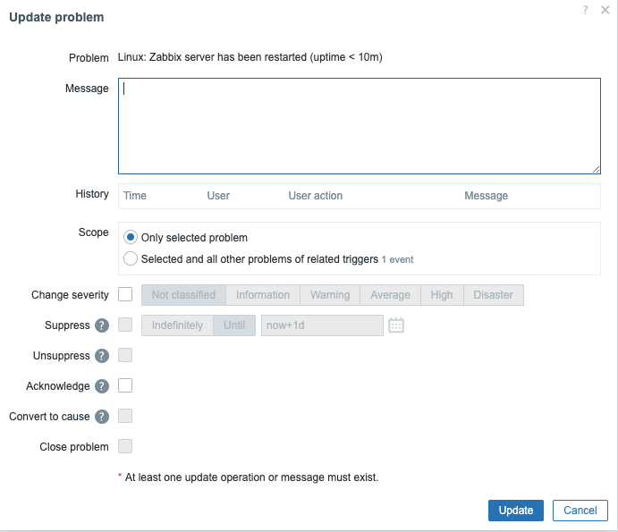


## User Roles

User roles have been in Zabbix since version 5.2 and make our lives easier by allowing us to make some custom adjustments to the standard defind user types in Zabbix.

When we go to our ```Permissions``` tab, we can see a box ```Role```. Press the ```Select``` box to see a popup with a list of roles to choose from. There are four standard roles to choose from.
You can create your own list of rules by going to the menu ```Users -> User Roles``` and create your own limited user.

The box is marked with an asterisk in front, so you need to select a user role for every user you create.

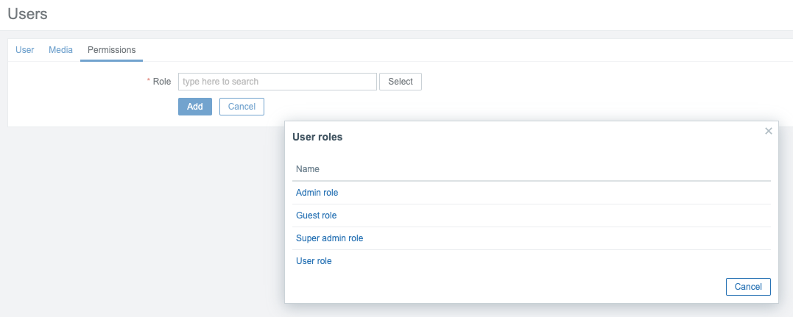

???+ warning
    Be aware that no permissions can be added to user roles only permissions can be revoked.

## User Groups

A user always needs to be member of one or more ```User groups```. We will not set any user rights directly on Users in Zabbix but we do this on User groups. So if a User needs the  permission to view or edit a host or a template then this is set on the ```User group``` wich has the permisson to view or edit a host or template group and never on a host or a template directly.


- User group : A field where we have to specify a unique name. This field in mandatory
- Users : Here we add users to our group. Users need to exist before we can add them. Just press select or type the name.
- Frontend Access : How users of the group will authenticate with Zabbix.
  - System default : The global configure access method
  - Internal : The most easiest way User and Password are configured in Zabbix ( Ignored if HTTP authentication is the global default.)
  - LDAP: LDAP/AD authentication ( Ignored if HTTP authentication is the global default )
  - Enabled : If checked the group is Enabled else it will be Disabled
  - Debug : Activate debug mode for the users in this group [More info about debug](https://www.zabbix.com/documentation/7.0/en/manual/web_interface/debug_mode)


Zabbix has a few different rights we can use on group level, as we have seen above. To make it easier for you I add them again:

<html>
  <head>
    <style>
      thead th { text-align:left; background:grey; color:white}
      tbody th { text-align:right; background: lightgrey; color:whitwhitee}
    </style>
  </head>
<body>
  <table>
    <thead>
      <tr>
        <th>Group rights</th><th>Zabbix User</th><th>Zabbix Admin</th><th>Zabbix Super Admin</th>
      </tr>
    </thead>
  <tbody>
    <tr>
      <th>Read/Write</th><td>Read Only</td><td>Full</td><td>Full</td>
    </tr>
    <tr>
      <th>Read only</th><td>Read Only</td><td>Read Only</td><td>Full</td>
    </tr>
    <tr>
      <th>Deny</th><td>None</td><td>None</td><td>Full</td>
    </tr>
      </tbody>
    </table>
  </body>
</html>

When it comes to permissions in Zabbix groups, the highest level will win. 
A user that has read and read-write rights on the same host will get read-write permissions. Except for Deny, Deny will always overrule.
So if we have a Zabbix ```Admin``` user then this user can have Read/Write rights, if we add a host in a hostgroup where our usergroup has read rigths, and the same server is in another hostgroup with Read/Write rights, then our user will have Read/Write permissions on the hosts.
However if the same host is only in the ```Read``` hostgroup then our user will only have read rights.
If we also add host in a Hostgroup where our usergroup has ```Deny``` rights then the server will not be visible.

Let's have a look at our ```User groups```, for this go to the menu ```Users -> User groups``` and click on one of the existing users. I used ```Guest``` in this case.

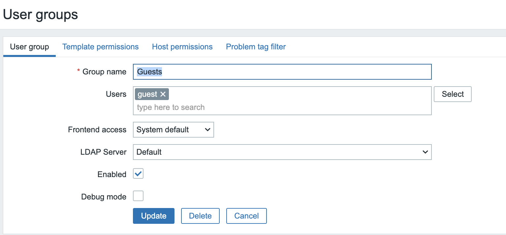

## Let's do this together:

Let us make three ```Host groups```, go to the ```Data collection``` menu -> ```Host groups``` and create a Host group for ```read``` , ```read-write```, and ```deny```.


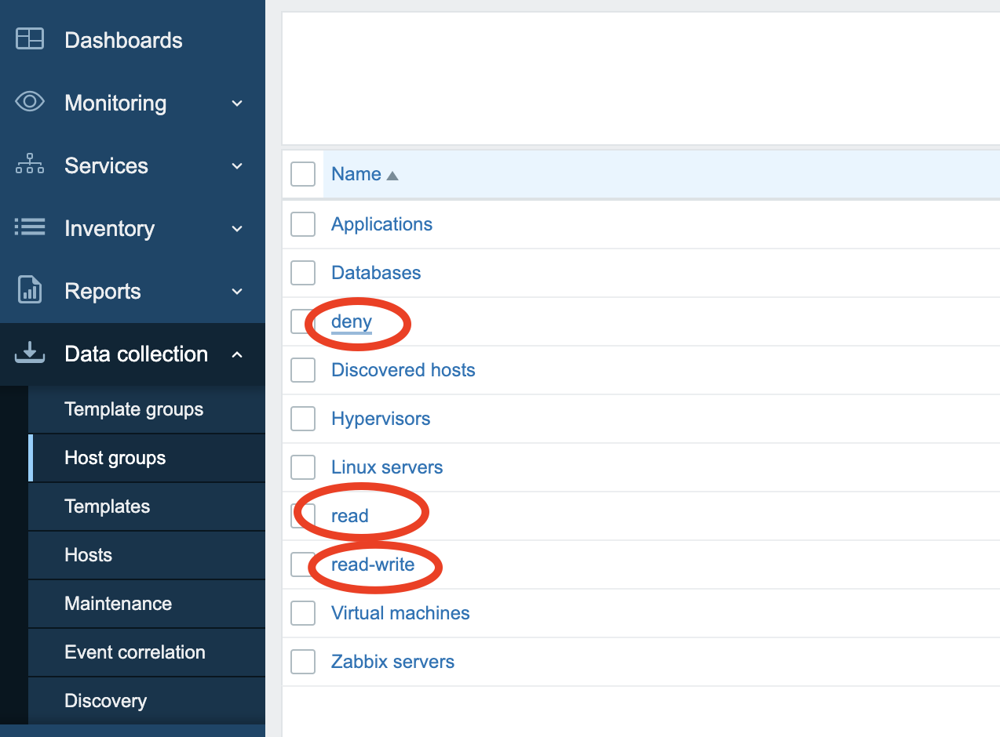

Next step is to create a host and add the host in our three groups. Go to the ```Data collection``` menu -> ```Hosts``` and press ```Create host``` on the right. Add a ```Host name```, the name is not that important and add the three ```Host groups``` we just made.


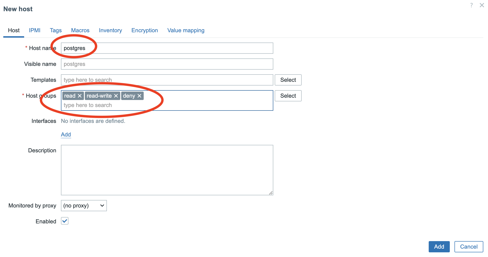

The only thing we need to do now is create our ```User``` and ```User group``` and give the correct rights. Go to our menu ```Users``` -> ``` Users group``` and click on the top right to ```Create user group```. Let's call this group our ```Admin Group``` as we need a Zabbix ```Admin``` that we can give read, read-write and later deny to show this.

 
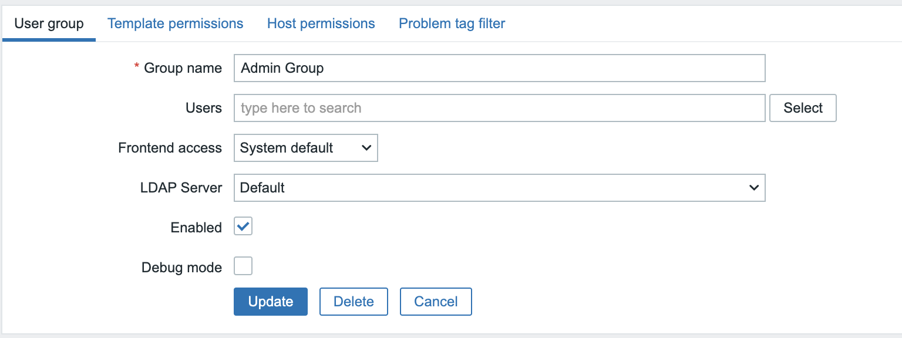

Next go to the tab ```Host permissions``` and start typing the name of our group ```read``` in the search box or press the ```Select``` button and select the correct group. Next before we do anything select also the correct permissions ```Deny``` and press the add just below NOT the button.
Do this also for the group ```read-write``` and ```deny```. If everything looks like in our screenshot then press the ```Add``` button

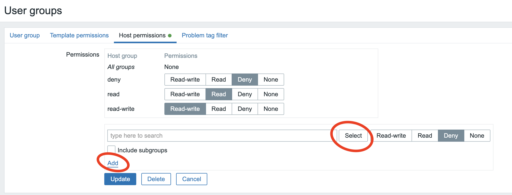

Now for the final step let's create a user. Go to the menu ```Users``` -> ```Users``` and create a new user, in the field ```Username``` we can add our fictive user with the name Brian.
In the ```Groups``` box we select our ```Users group``` this was ```Admin Group```. Don't forget also to add a Password we need to do this twice.
Next go to the tab ```Permissions``` and select the role ```Admin role```.
You will see directly once selected that our users bridan has read, write and deny on the correct groups. Press ```Add``` at the bottom.

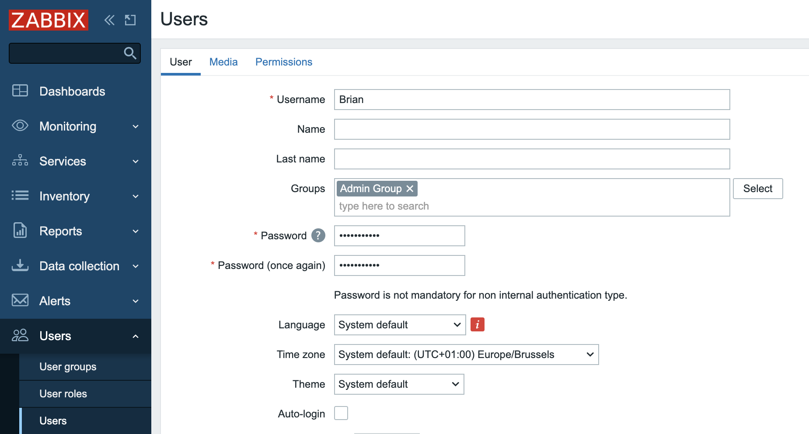
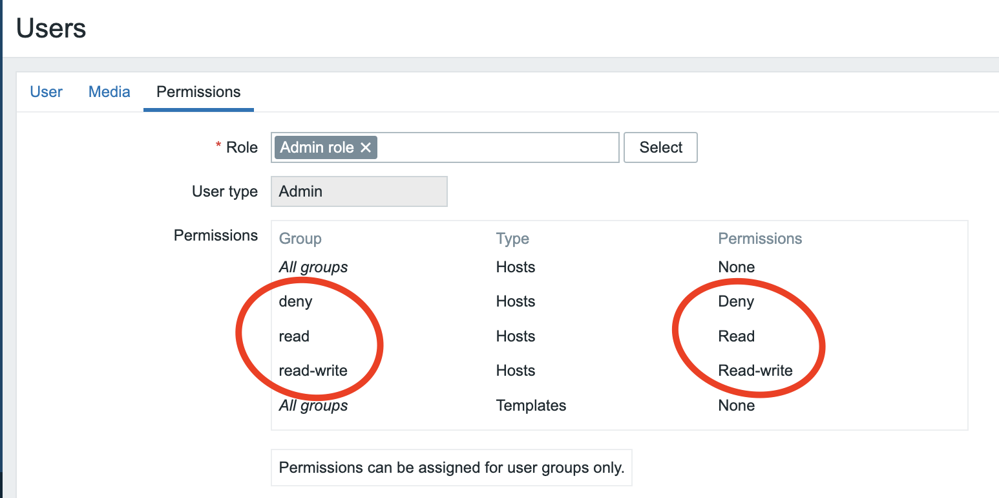

Now it's time to check if everything is as expected. Our user ```Brian``` if all goes well shouldn't have any rights as we explicitly denied accesss.
Press ```Sign out``` at the bottom left and then login as user ```Brian```.
Go to the menu ```Monitoring``` -> ```Hosts```. Select all the hosts groups, you should normally only see read, and read-write. Our host group ```Deny``` is not visible and our host ```postgres``` is not visible either.

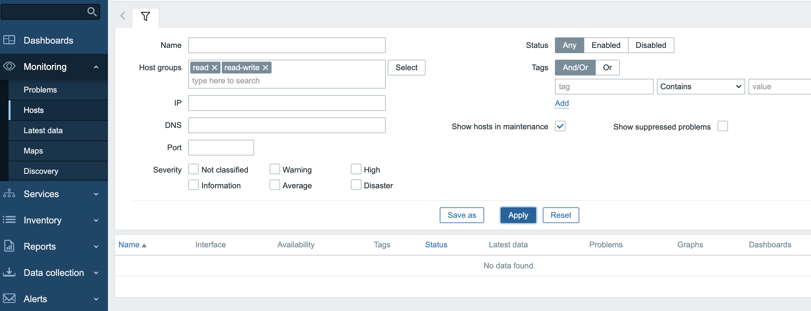

Now log back in as user ```Admin```, our Zabbix Super Admin and remove the deny group from our ```Admin group```. This can be done by selecting the ```None``` permissions for the group ```Deny``` in the ```Host permissions``` tab from our ```User group```.

Log back in as our user Brian go back to the ```Monitoring``` menu to ```Hosts```. If all goes well our groups ```read``` and ```read-write``` are still selected if nog you just select them again. You will see that our host ```postgres``` is visisble and that you can click on it to edit the host propreties.

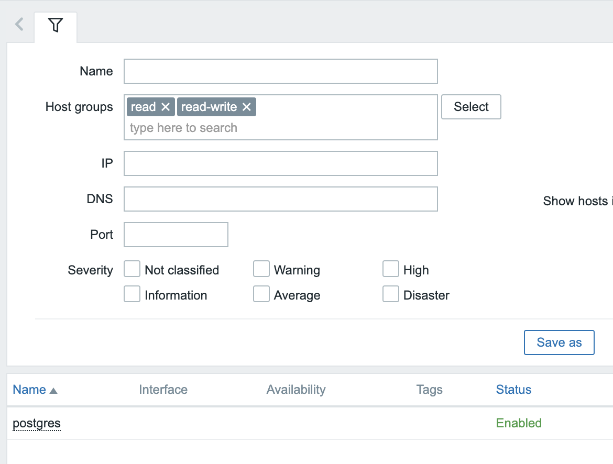
 
As final test you can try to remove the group ```read-write``` same as we did before with the ```Deny``` group. This time only the ```read``` group will be visible for our user and Brian will not be able to edit our host ```postgres``` anymore.


???+ note
    A Zabbix user needs to be created with a user role. You cannot create one without. 

???+ warning
    Be careful if you use the API at the time of writing it's possible to create a Zabbix user with the API without a role. When created by the API the user can even be saved by the frontend afterwards !

???+ info
    More information can be found in the online Zabbix documentation [here](https://www.zabbix.com/documentation/7.0/en/manual/config/users_and_usergroups/user)
